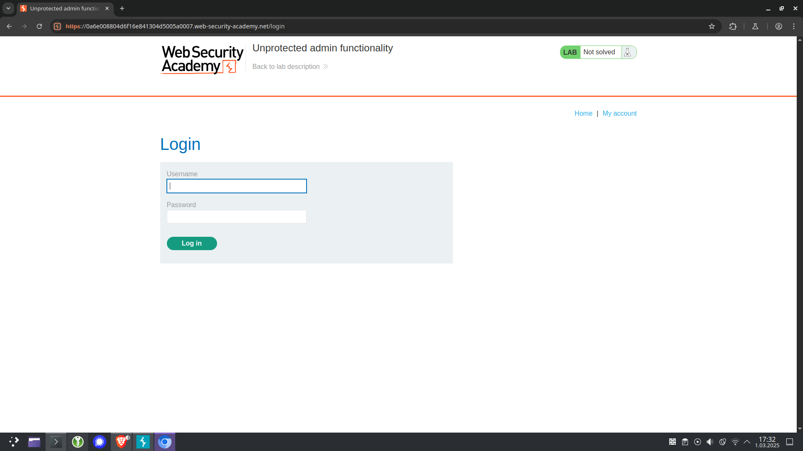
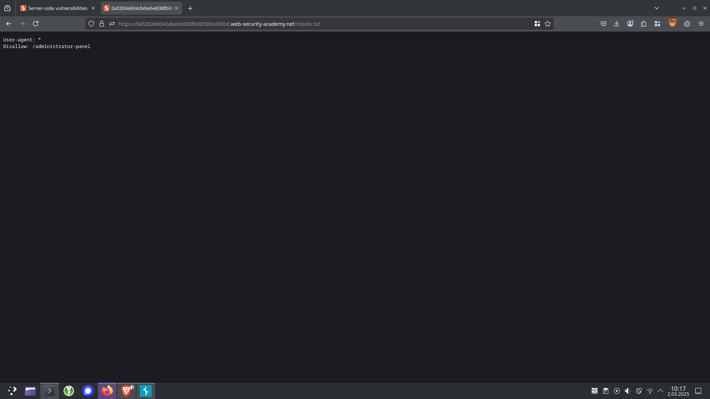
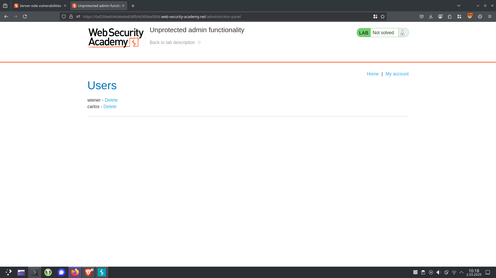
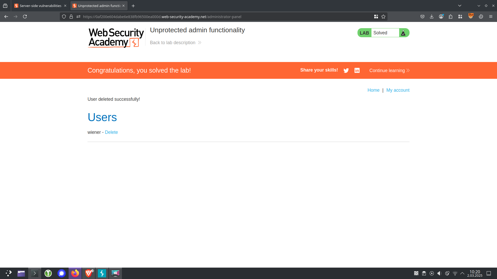

# Lab: Unprotected admin functionality
 This lab has an unprotected admin panel.

Solve the lab by deleting the user carlos. 

## Walkthrough:
At a first look, this site looks like a typical web shop. What comes to my eyes is the **My account** button on the right site. Let’s check it out.


There is a form for signing in. I doubt we know any account we can use for login.


There are no information in the source code. I don't think running **ffuf** here is necessary. 

Let's try with accessing the *robots.txt* file.
```javascript
/robots.txt
```

And we got something!


Now we know about an address *administrator-panel* that wasn't meant to be visible. So ... let's try accessing it! :grin:

Look at that. Now we’re able to access some functionalities, that, I would guess, shouldn’t be accessable as a non-administrator.

So let's delete **carlos** -> like we are supposed to do.

And thanks to that, the lab has been solved :white_check_mark:

