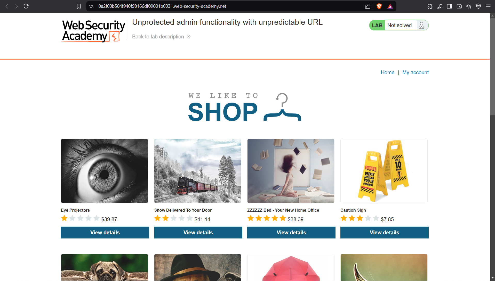
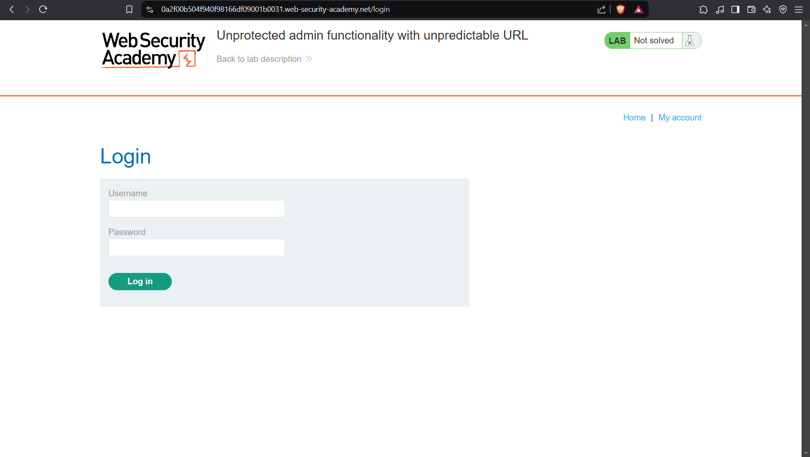
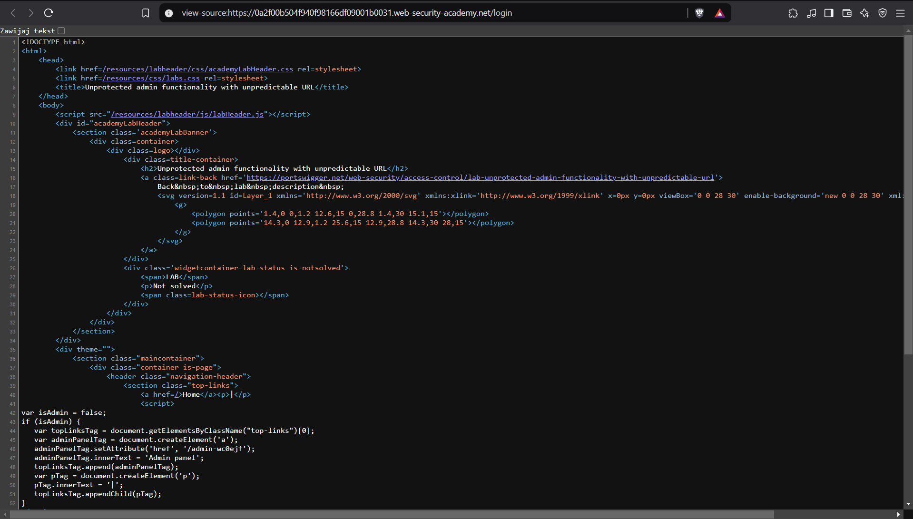
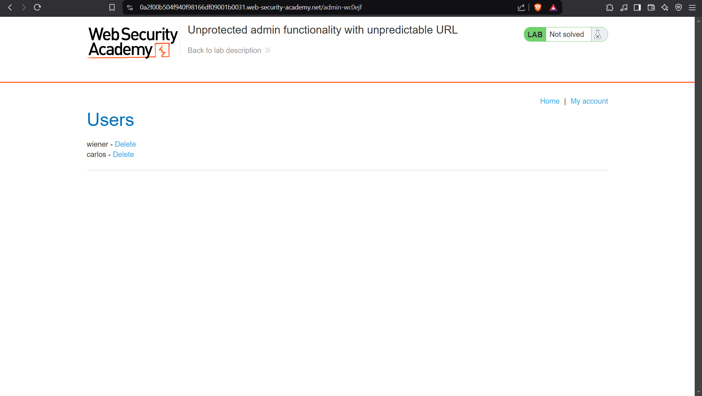
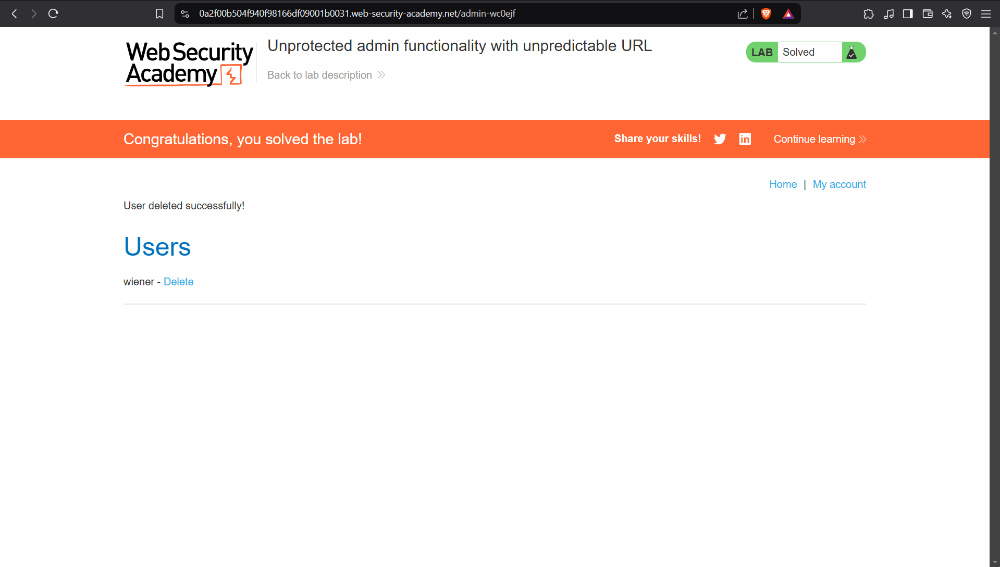

# Lab: Unprotected admin functionality with unpredictable URL
This lab has an unprotected admin panel. It's located at an unpredictable location, but the location is disclosed somewhere in the application.

Solve the lab by accessing the admin panel, and using it to delete the user carlos. 

## Walktrough:
When we access the lab, at the first glance we don’t see anything special. 

Home button allows to come to the main site (which is visible on the upper screen). My account button redirects us to a login page, but we don’t know any credentials.

But we know that there is an unpredictable URL link do the admin panel. The probability of finding it through fuzzing is pretty low I guess. Since we are on the login panel, maybe here we can find something useful → maybe in the source.

Wow, look at that! Can you see it? There is the admin panel URL right in the source code. There would be now way to find it through fuzzing. But here? Nice, let’s check it out

We got the access! And we didn’t need any authentication.

Now all we have to do is delete carlos. So, lets click the button.

Thanks to that, the lab has been solved :white-check-mark:

