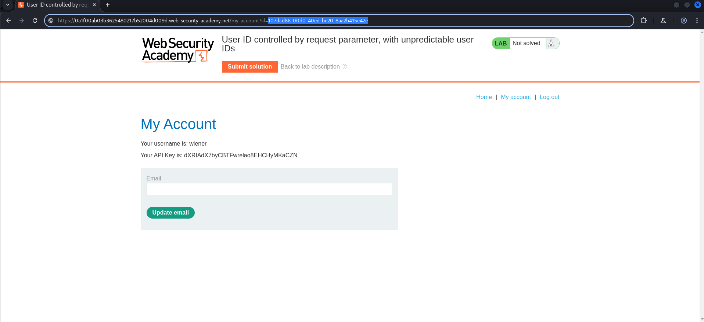

# Lab: User ID controlled by request parameter, with unpredictable user IDs
This lab has a horizontal privilege escalation vulnerability on the user account page, but identifies users with GUIDs.

To solve the lab, find the GUID for `carlos`, then submit his API key as the solution.

You can log in to your own account using the following credentials: `wiener:peter`

## Walktrough:
Let’s check the site.

In this lab we have to abuse an IDOR vulnerability, so let’s go to the login page and use given credentials.

After logging in we can see 2 things:

- GUID in URL,
- API key.

There is probably no way we guess GUID from carlos. So let’s think what can we do.

I think that the best solution will be to use Burp Suite and see whether we can see something interesting in the requests.

Unfortunately there was nothing hidden in the requests, so we gotta dig somewhere else. Let’s try exploring the applicaiton more. I didn’t pay attention to the home site, so let’s go back there.

When we explore a post, we can see that it was written by carlos (bottom of the picture). Also it is clickable. Let’s check it.

That’s interesting! Can you see what happened after clicking on carlos → post’s editor?

Okay, let’s copy the GUID from the url and try pasting it in the user panel.

Okay, that worked!

Now all we have to do is copy carlos’s API Key and submit it.

And that’s how the lab has been solved!

