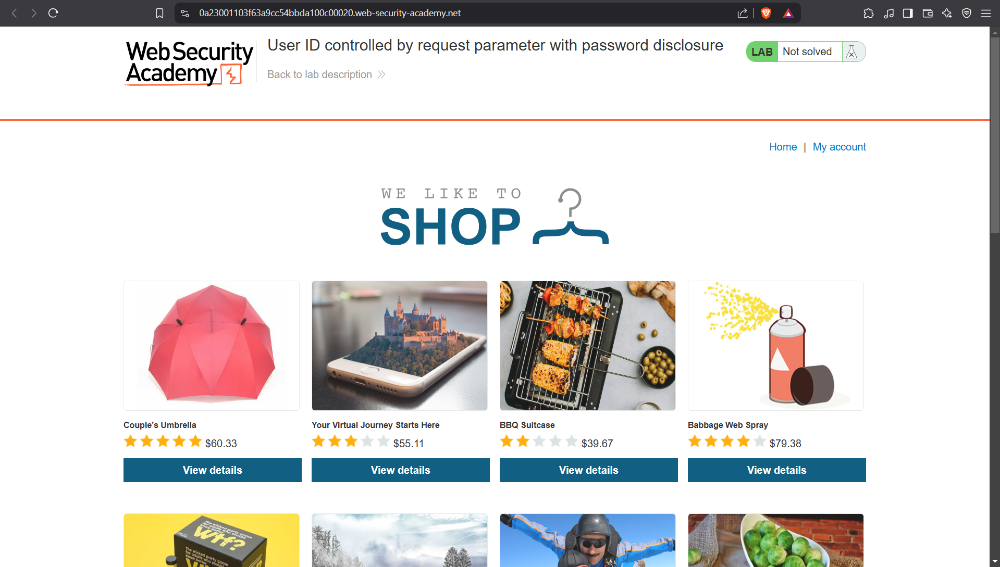
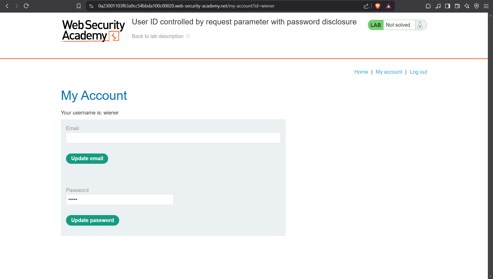
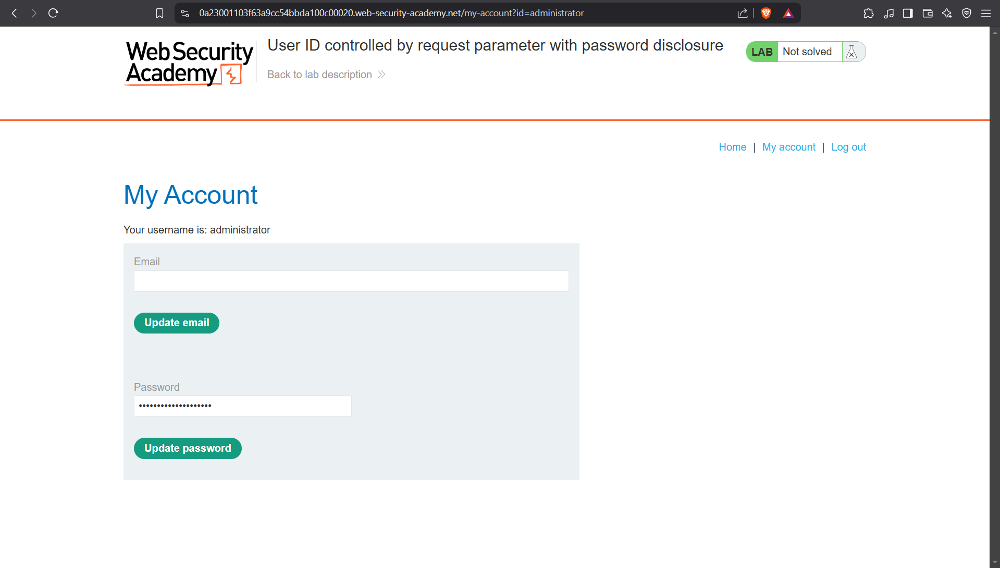
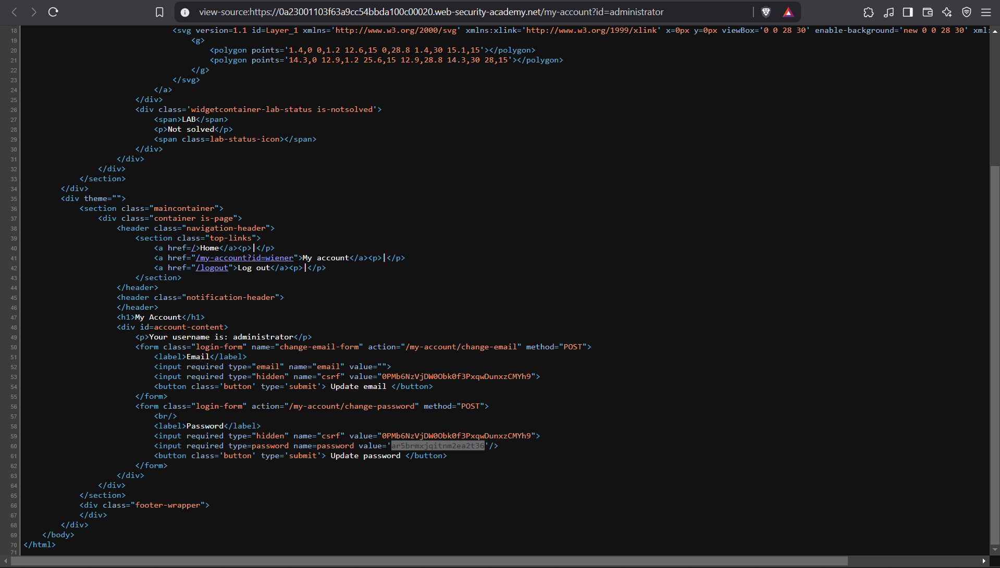
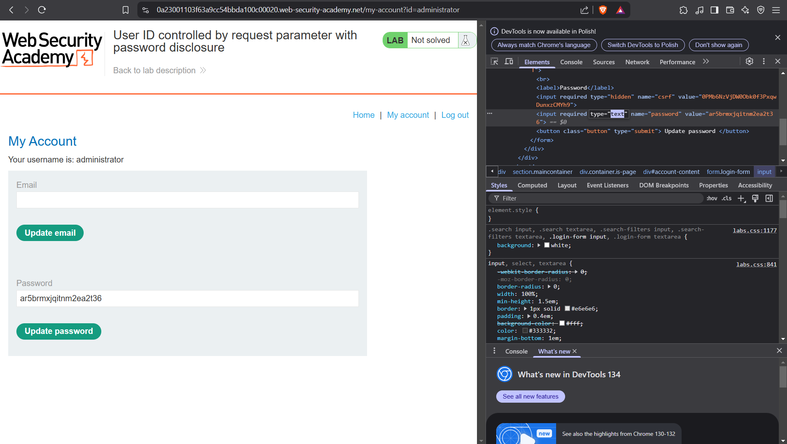
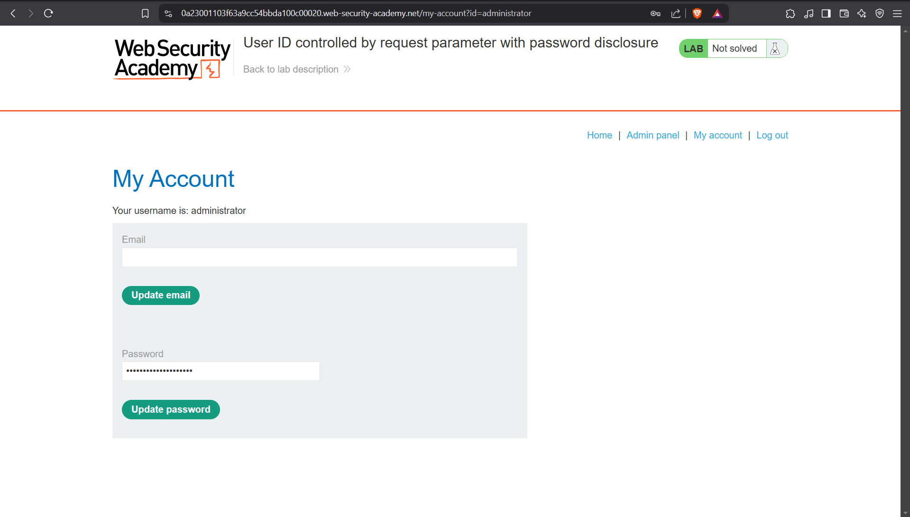
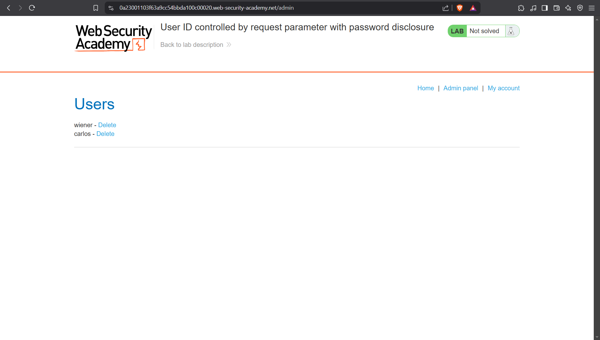
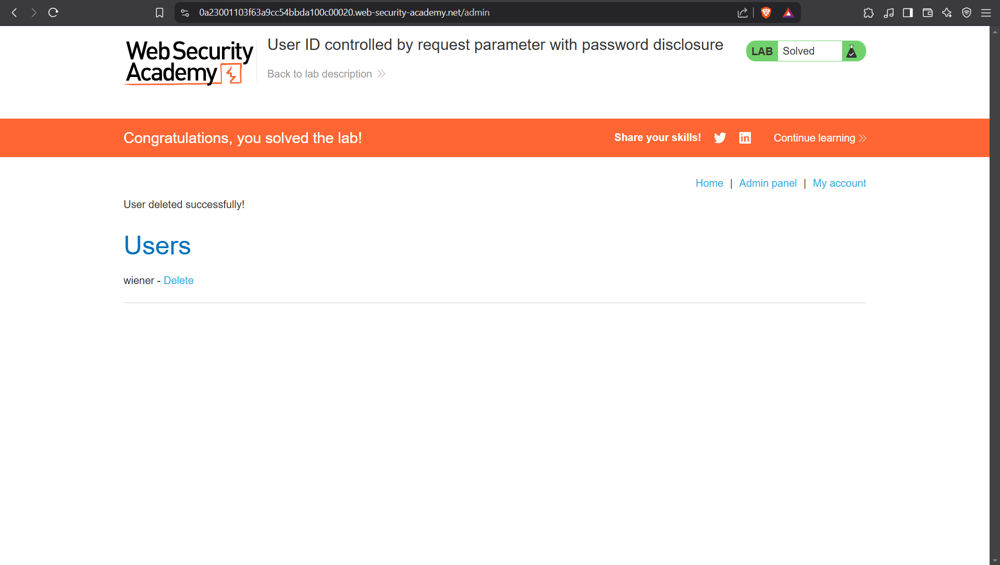

# Lab: User ID controlled by request parameter with password disclosure
This lab has user account page that contains the current user's existing password, prefilled in a masked input.

To solve the lab, retrieve the administrator's password, then use it to delete the user `carlos`.

You can log in to your own account using the following credentials: `wiener:peter`

## Walktrough:
When we access the home site, we can see a typical internet shop or something like that.

If we explore the application, we don’t see anything anusual in products’ details, so let’s try given credentials.

Indeed, when we login we can change password. We can also see our user’s id in the URL.

If we change id in the URL from wiener to administrator, we can see something interesting.

To see the password, we can simply view the page source.

We can also inspect the provided password, and change the input type from password to text.

Okay, let’s use found password to log into the administrator.

Now we can see the admin panel button, so let’s click on it.

Great! Okay, so all we need to do is delete carlos. Let’s not waste any minute.

And that’s how we solved the lab.

