# Lab: User role controlled by request parameter
This lab has an admin panel at /admin, which identifies administrators using a forgeable cookie.

Solve the lab by accessing the admin panel and using it to delete the user carlos.

You can log in to your own account using the following credentials: wiener:peter

## Walktrough:
We are accessing the main site, but it doesn’t look any odd.
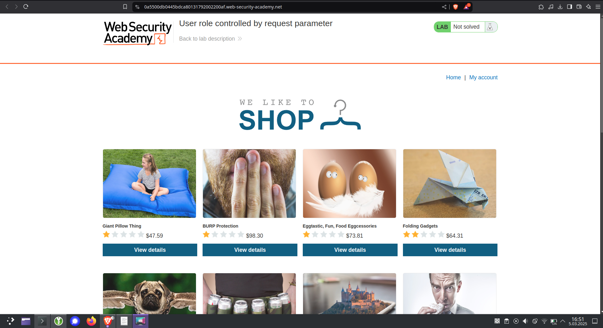

We know that there is the admin panel at /admin URL. Unfortunately when we access this site, we are being told that *Admin interface only available if logged in as an administrator*.
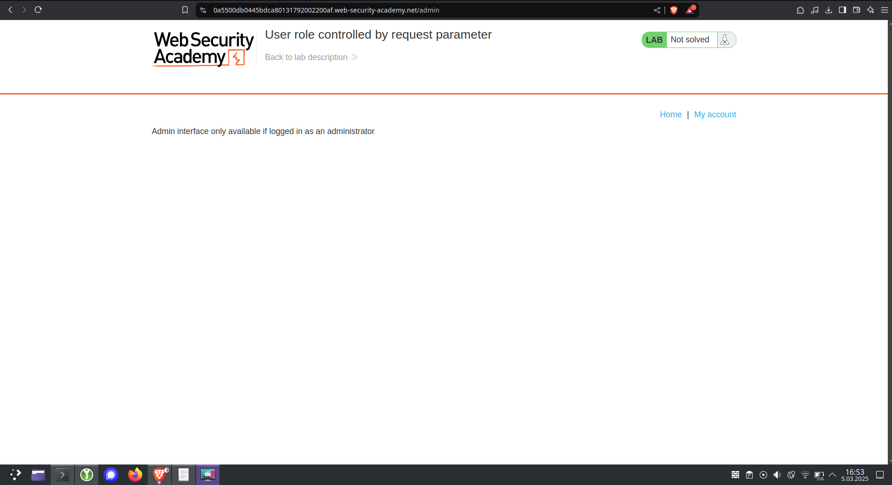

Okay. We are being provided with credentials wiener:peter → let’s use them.
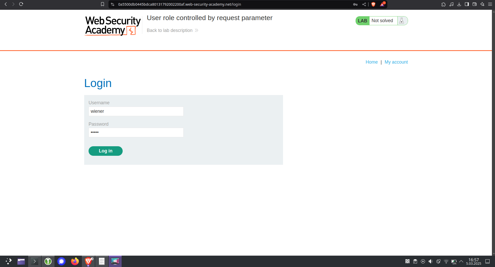

We have accessed the account. There is a form for updating email. We can see that something appeared in the URL → **id=wiener**. Can we try accessing admin id by any chance?
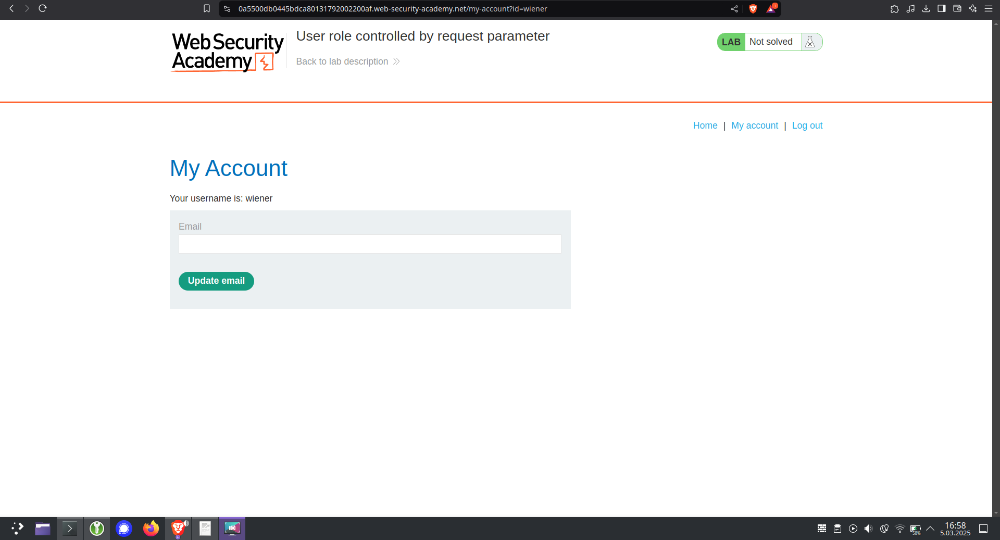

It looks like trying adding parameters like:

- id=admin
- &admin=true
- &role=1

doesn’t work. I decided to try Burp Suite, in hope there will be something I was missing in the browser.


And, well, I missed something in the browser → in Burp it was more visible for me. Can you see it?
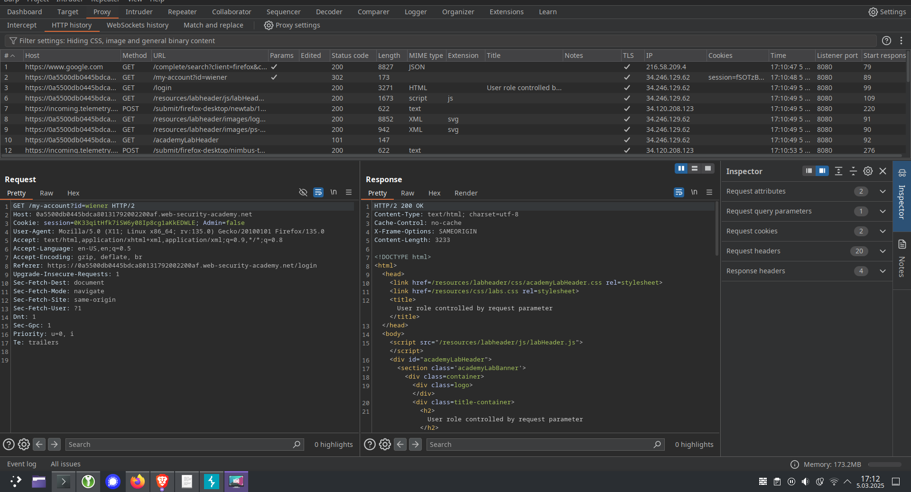

So I decided to intercept the request after logging in as wiener and change the admin parameter to true.
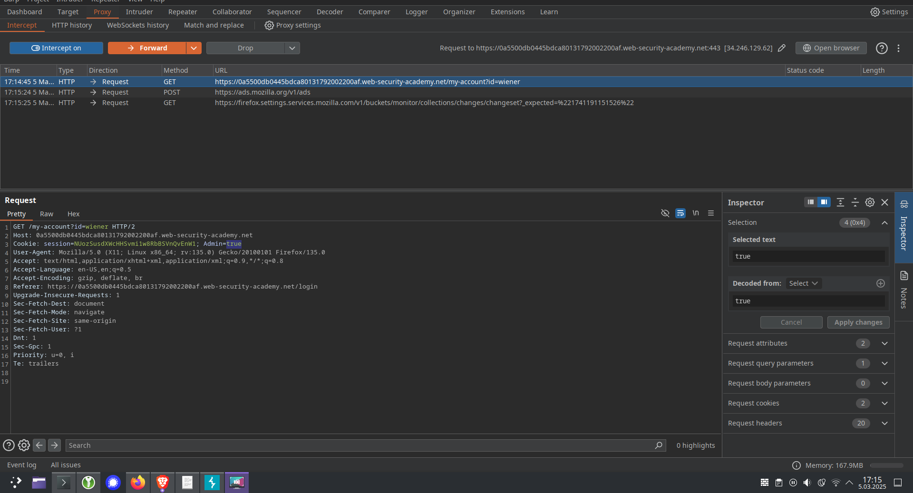

After forwarding the request and editing admin parameter, we can see that a new button occurred in the panel: Admin panel. Let’s try accessing it!
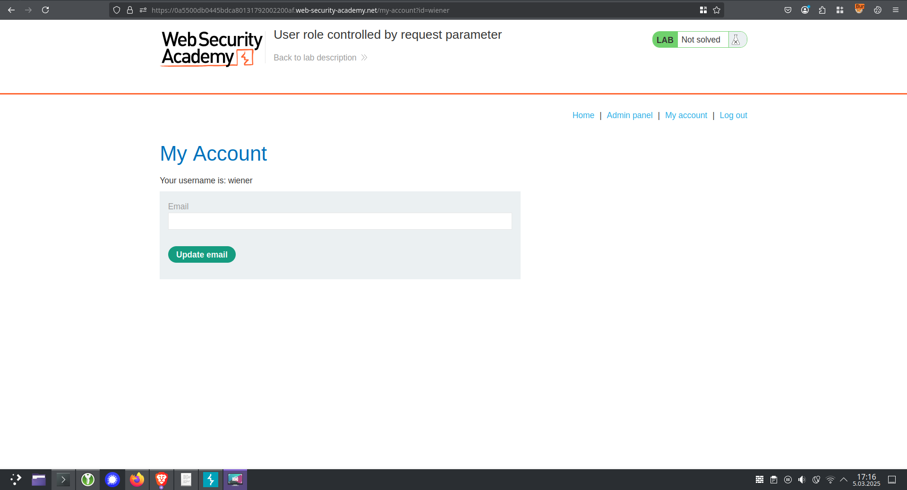

After trying to access the Admin panel, we are being provided again with the information, that we are not administrators. The parameter probably switched back to Admin=false. 
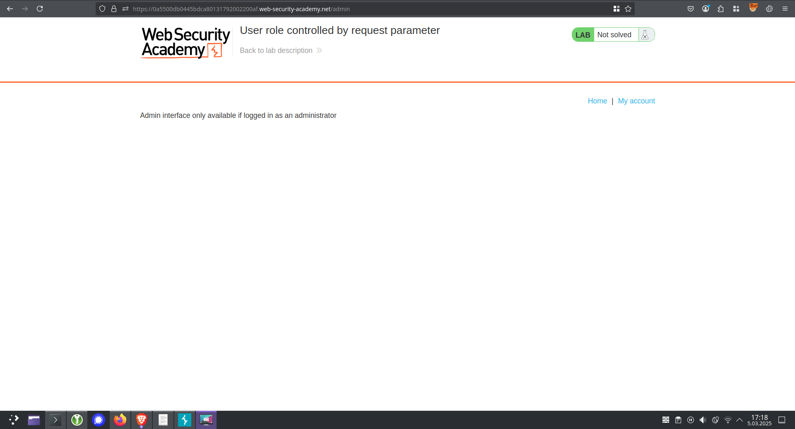

Let’s try going to /admin URL, intercept the request, and edit the Admin=true parameter there.


As we can see here, there is no parameter Admin → let’s add it by adding 
```javascript
; Admin=true
```
to the Cookie header.
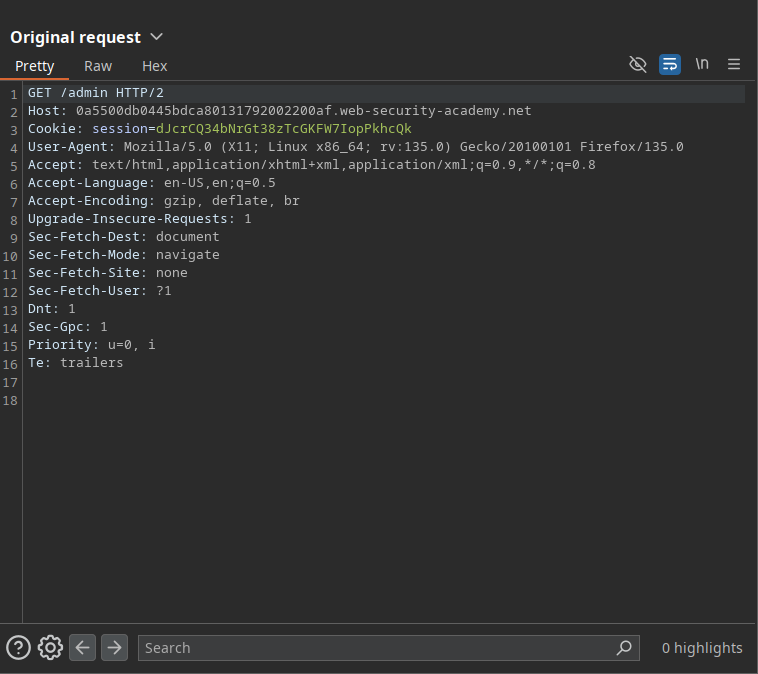

Finally we got access to the admin panel! Now all we need to do is deleting carlos.
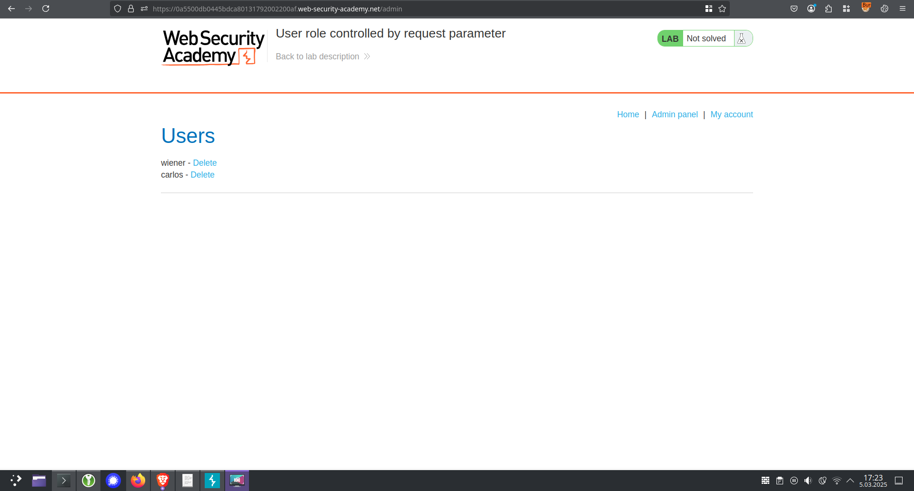

But if we click delete button, we are being told that we are not administrators … 
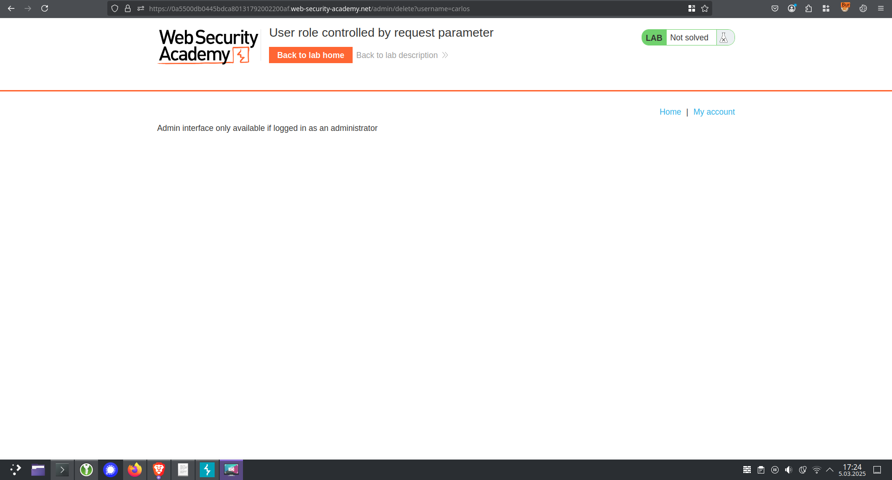

So let’s take the same action → intercept the delete request, add Admin=true parameter, and see what happens
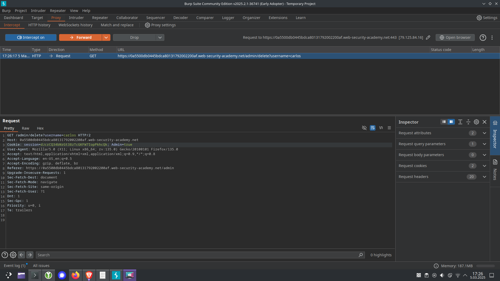

And so, the lab has been solved!
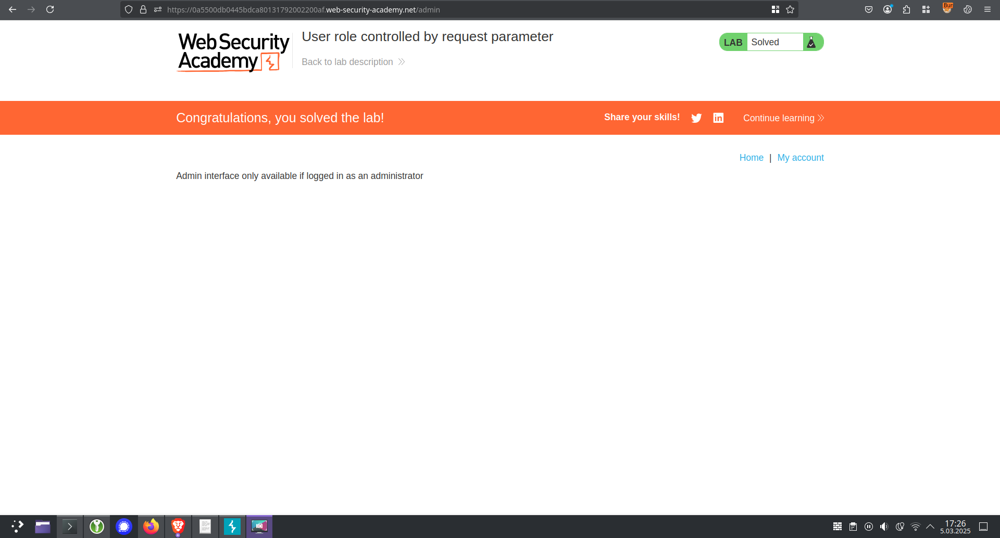
