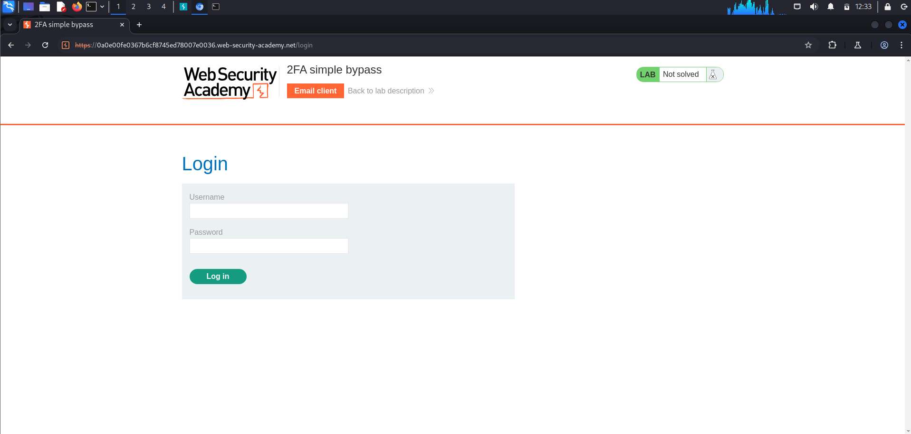
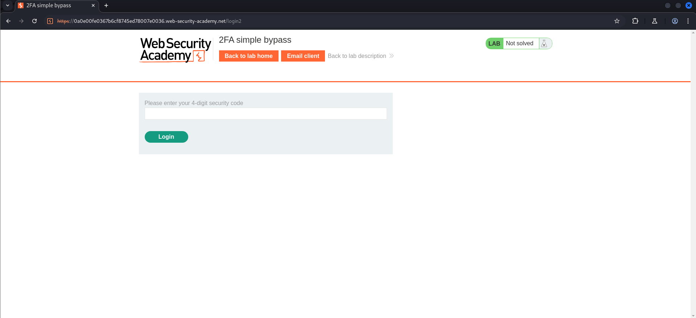
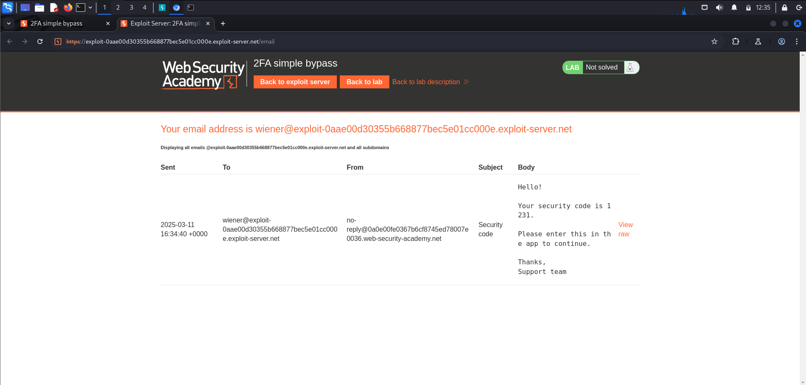
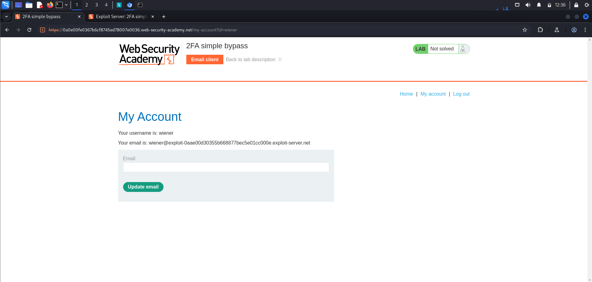
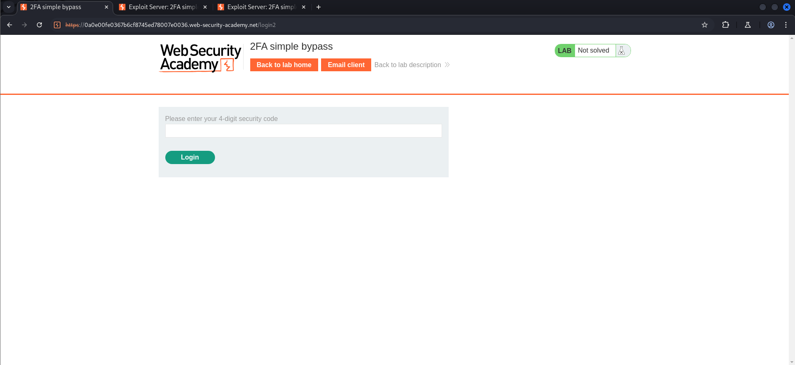
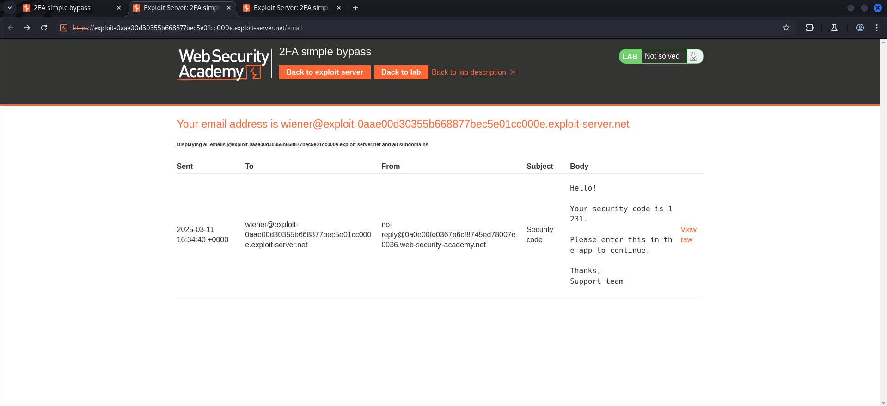
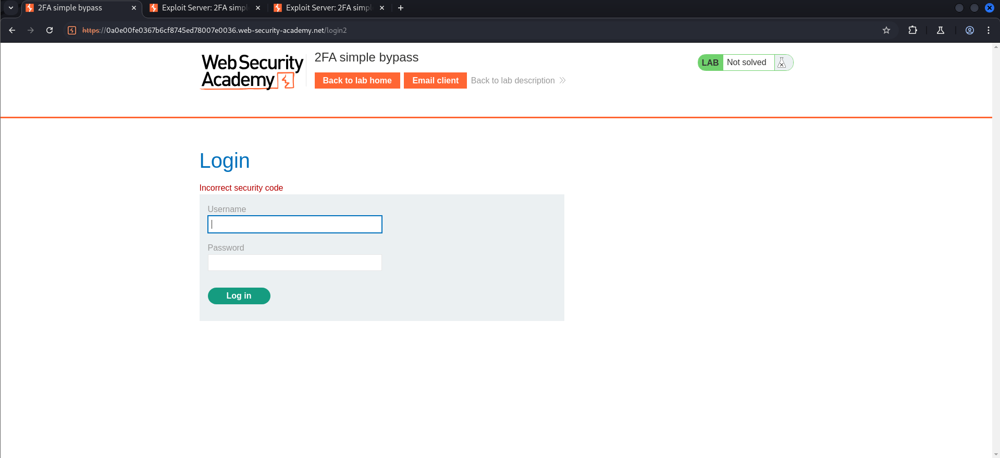
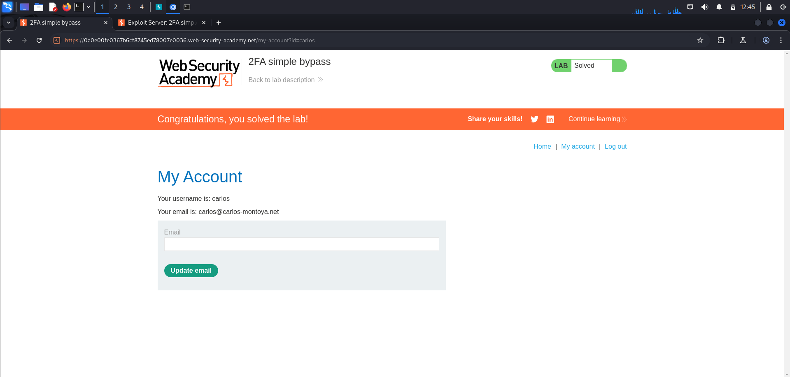

# Lab: 2FA simple bypass
This lab's two-factor authentication can be bypassed. You have already obtained a valid username and password, but do not have access to the user's 2FA verification code. To solve the lab, access Carlos's account page.

- Your credentials: `wiener:peter`
- Victim's credentials `carlos:montoya`

## Walkthrough:
Let’s access the login page and see with Burp what’s hiding in the requests.

When we provide username and password, we are being asked for a 4-digit security code.

When we click on the Email client button, we are being redirected into another site, where we can get our 4-digits security code.

And with that code we can log into the application.

When we try logging as carlos, we also need to provide a 4-digits security code.

But if we click on the Email client button, we are being redirected into a site, where are wiener’s information. Can we use his code to log into another user?

Nope, that’s not possible.

Also, if we try changing id in the URL from wiener to carlos, we are being redirected into the login page.

So what else can we try? 

The task is to bypass the 2FA. Let’s login as carlos and simply change the URL (delete login2).

Look at that, it worked! All we had to do was go to another URL by simply removing login2 from the URL.

