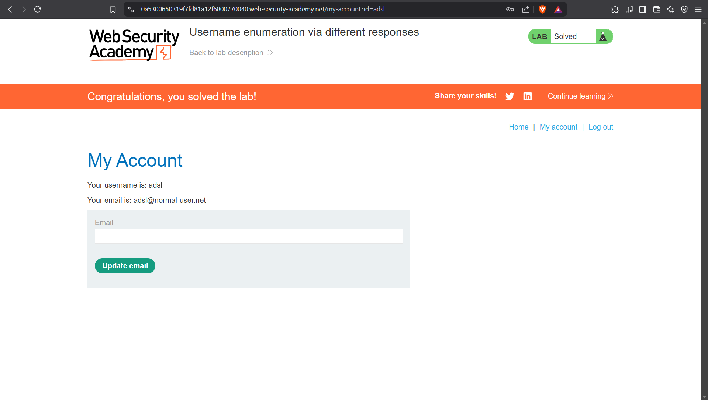

# Lab: Username enumeration via different responses
This lab is vulnerable to username enumeration and password brute-force attacks. It has an account with a predictable username and password, which can be found in the following wordlists:

- [Candidate usernames](https://portswigger.net/web-security/authentication/auth-lab-usernames)
- [Candidate passwords](https://portswigger.net/web-security/authentication/auth-lab-passwords)

To solve the lab, enumerate a valid username, brute-force this user's password, then access their account page.

## Walkthrough:
Let’s go straight to login page. We have to try brute-forcing here. We can use simply Burp Suite or ffuf.


Let’s run Burp to see the login request. This time we’ll use  ffuf → it’ll be faster than Burp in the Community Edition.


First what we need to do is to copy the request from burp into a .txt file.

We want to add keywords to username and password also.


Next we need to prepare wordlists given in the lab description.

I’ve got a uname.txt and a pass.txt.


Okay, it’s time for ffuf.

Our command will look like that:
```bash
ffuf -request req.txt -request-proto https -mode clusterbomb -w uname.txt:FUZZUSER -w pass.txt:FUZZPASS
```
- we pass the request with headers and parameters with -request flag,
- we need to specify request protocol with -request-proto flag,
- we will use clusterbomb, because we have many usernames and many passwords,
- lastly we specify keywords to certain wordlists.

After running ffuf we can see that there are many responses with size 3140 → it is good for enumerating users, because we can assume these users exists, but passwords do not match.

To be sure the best option would be to use burp and verify responses with the sizes.

But since we’re looking for a certain account, we can filter out responses that come back with size 3140 → since there are so many of them.


Let’s add a flag -fs 3140. With that we will filter our responses with size 3140.

Looks like we have found something. Let’s check whether we can log into this account.


Yes, we can! And that’s how the lab has been solved!


