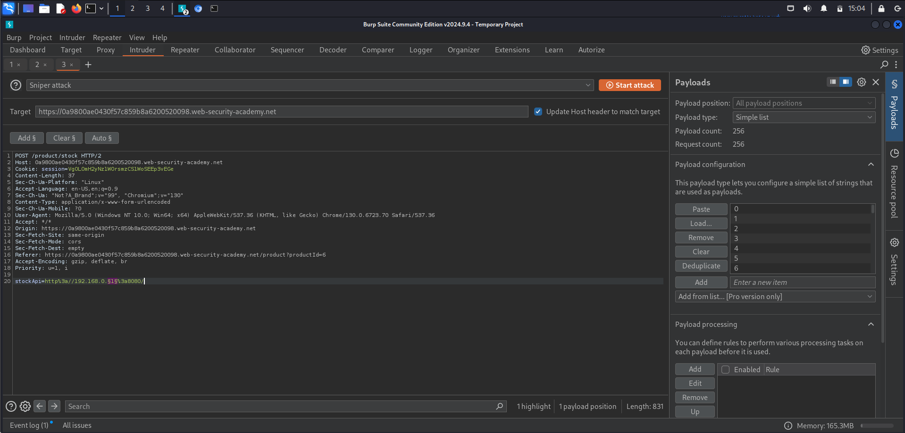

# Lab: Basic SSRF against another back-end system
This lab has a stock check feature which fetches data from an internal system.

To solve the lab, use the stock check functionality to scan the internal `192.168.0.X` range for an admin interface on port `8080`, then use it to delete the user `carlos`.

## Walkthrough:
Let’s check the application. We can instantly go to a details page of a certain product. When we scroll down, there is a button, that allows checking stock of a certain product. Before clicking it, run Burp Suite so we can see the request.

We can see there is one body parameter where the URL is being sent.

Let’s use it to connect to an inside resource. We are being tasked to scan the internal 192.168.0.X range. My solution will be to use Intruder this time, but first we need a list ip addresses. Let’s simply use python to generate a list of addresses.

Now let’s use our list as payload for Intruder. We have to load it in the right site.

We can see that the response with the address 192.168.0.12 is slightly different. Let’s send it to repeater and add /admin to the end of the URL.

I think that’s the place! Okay, let’s find a way to delete carlos.

If we scroll a little bit down, we can see a new url → exactly what we need.

Let’s paste the missing part, and URL-encode it with Ctrl+u. Time to send the request.

In the burp we can see 302 status.

And so the lab has been solved!

